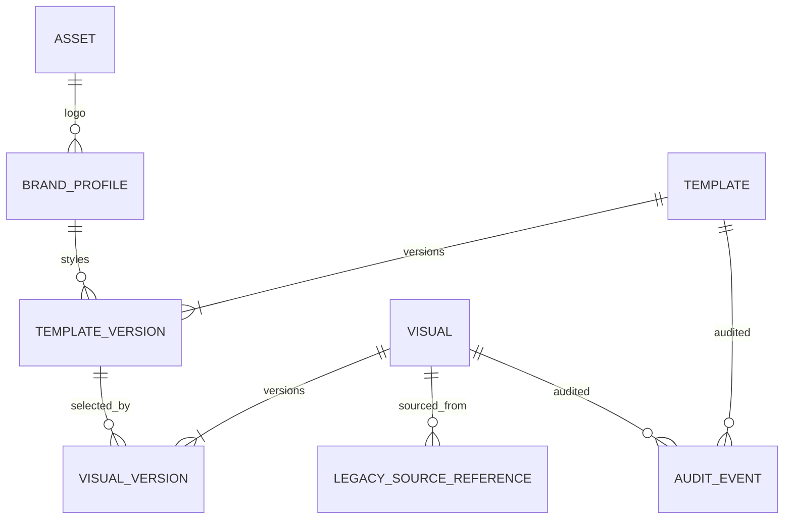

# Canonical data model

## Entity boundaries

| Entity | Identity and responsibility | Mutable fields / immutable history |
|---|---|---|
| BrandProfile | Reusable brand name, logo reference, semantic colors and optional default typography. | Current profile is editable; audits record changes and renders resolve the selected snapshot/policy. |
| Asset | Local binary metadata: id, kind, original name, MIME type, content hash, storage locator, intrinsic dimensions, created time. | Content-addressed bytes are immutable; replacement creates a new asset record. |
| Template | Stable id, family, name, visual type, lifecycle state, active published version id, timestamps, provenance. | Identity/current pointer may change; versions remain immutable. |
| TemplateVersion | id, template id, monotonically increasing version number, page width/height mm, orientation, copies per page, document JSON, creator/time and publication metadata. | Immutable after publication; edits happen in a new draft. |
| TemplateDocument | Versioned JSON document: `schema_version`, page/artboard, print margins/gaps/slots, element list, repetition rules, defaults. | Schema upgrades are explicit, validated transformations. |
| Element | Stable id, type, x/y/width/height mm, rotation degrees, z-index, visible/locked flags, style, and content/binding. | Mutated through immutable document commands. V1 types: text, rectangle/band/background, line/border, image/logo. |
| Visual | Stable id, name, visual type, template id, stock class, location, flow, description, accent color, lifecycle state, current draft/published version references, timestamps. | Search/current-state projection; source versions hold immutable approved content. |
| VisualVersion | id, visual id, version number, structured content, selected TemplateVersion id, notes, creator/time and publication metadata. | Published content is immutable. |
| LegacySourceReference | Source identifier/name, sheet or slide, side, raw source text when needed, migration batch/version, validation state. | Preserved as provenance; sensitive raw evidence remains in the private local DB only. |
| AuditEvent | id, entity type/id, optional version id, action, timestamp, actor when available, structured details/diff. | Append-only; correction is a compensating event. |

### TemplateDocument and element detail

Canonical persisted geometry uses finite millimetres, never browser pixels. Element positions are relative to the page origin. Width/height must be positive. Rotation uses degrees in a documented clockwise screen convention. Z-index defines paint order; hidden and locked are independent. Text style stores font family, size in points, weight/style, horizontal and vertical alignment, line height, wrapping/overflow behavior, fit policy, and color. Binding is a tagged choice between literal content and an allow-listed path such as `visual.location`, `visual.flow`, `visual.description`, `visual.accent_color`, `brand.logo`, or `brand.primary_color`.

The TypeScript contract persists the following version-1 JSON shape (snake_case is intentional for the serialized format):

- `schema_version` is exactly `1`; unsupported versions fail validation until an explicit document migration exists.
- `page` contains positive `width_mm` and `height_mm`, plus `orientation` (`portrait` or `landscape`).
- `print_rules` contains `copies_per_page`, four non-negative `margins_mm`, non-negative `gap_mm`, and `slots.rows`/`slots.columns`. Copy count equals rows × columns.
- `repetition` is either `{ "kind": "none" }` or a grid rule with positive rows/columns and non-negative horizontal/vertical gaps. `defaults` carries optional font and color defaults.
- Every element has an ID, `type`, `x_mm`, `y_mm`, positive `width_mm`/`height_mm`, finite `rotation_degrees`, integer `z_index`, and boolean `visible`/`locked` flags. Negative positions are allowed for editing and are handled by publication/print rules.
- V1 element types are `text`, `rectangle`, `band`, `background`, `line`, `border`, and `image`. Text includes typed text/color bindings and text layout style, including `fit_policy` (`none` or `shrink_to_fit`); shapes and lines carry typed fills/strokes; images carry an asset ID or the `brand.logo` binding and an explicit fit rule.
- Text bindings accept only literal text or allow-listed `visual.name`, `visual.location`, `visual.flow`, `visual.description`, and `visual.stock_class` paths. Color bindings accept literal colors or `visual.accent_color`/`brand.primary_color`. Image bindings accept an asset ID or `brand.logo`.

`validateTemplateDocument(input)` accepts untrusted JSON and returns either a typed document or structured diagnostics (`code`, JSON-style `path`, `message`, and severity). It rejects unknown schema versions, duplicate element IDs, missing/unsupported bindings, invalid page/print data, non-finite geometry, non-positive element dimensions, and values outside JavaScript's safe integer range. It does not reject off-page positions; publication and print policy decide how those are handled.

### Identity and lifecycle

Existing WVM IDs are preserved as imported identities; generated IDs must be globally unique. Duplicate IDs, dangling foreign keys, unknown lifecycle states, or unsupported document schema versions fail validation. Lifecycle is exactly `Draft`, `Review`, `Published`, `Retired`. Legal transitions are Draft→Review, Review→Draft, Review→Published, Published→Retired, and Retired→Draft only by creating a new version/re-activation operation with an audit event. Published versions cannot be overwritten or deleted through application commands.

The six `gang-special-2up` exception visuals carry an explicit validation state and are ineligible for trusted publication while that state is not `validated` with a recorded reviewer/date/evidence reference.

## Relational and document storage

Keep searchable identity and catalog fields relational: IDs, name, type, family, template ID, stock class, location, flow, lifecycle, version pointers, and timestamps. Store each immutable TemplateVersion layout atomically as validated, schema-versioned JSON. VisualVersion structured content may also be JSON-backed if validation and commonly searched fields are projected relationally. Do not store derived rendered strings as the sole data source.

This hybrid boundary avoids row-by-row partial layout saves while preserving indexed search and foreign-key integrity. See ADR-003.

## Relationships

Brand binding can resolve at render time; a TemplateVersion need not store a foreign key to one immutable logo binary unless the version explicitly pins an asset for reproducibility.

## SQLite rules

- Enable `PRAGMA foreign_keys = ON` on every connection.
- Use numbered, ordered schema migrations with a schema version table. Each migration runs in a transaction and leaves the prior schema intact on injected failure.
- Add indexes for visual lifecycle/type/template/location/flow/name and version foreign keys; verify catalog query plans before adding speculative indexes.
- Repository operations use transactions for version creation plus current-pointer update plus audit event. A failed step rolls back the complete logical change.
- Enforce unique `(template_id, version_number)` and `(visual_id, version_number)`; constrain page sizes and copy counts at the application boundary and validate again on read.
- Asset byte writes use temporary files and atomic rename before metadata commit; failed metadata writes remove unreferenced temporary bytes.
- Do not expose SQLite row types outside persistence adapters.
